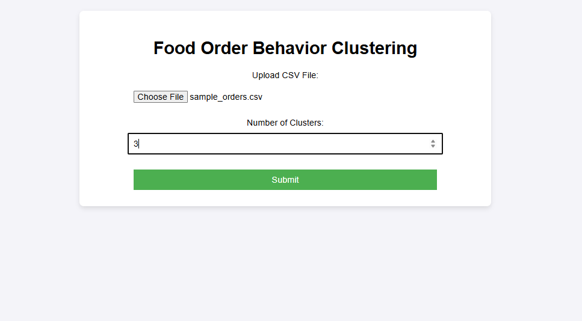

# Food Order Behavior Clustering Web Application

## Project Overview

This is a Flask-based machine learning web application designed to segment users based on their food ordering behavior. The app uses **Hierarchical Clustering (Agglomerative Clustering)** to group users by analyzing features such as total number of orders, preferred meal type, and average time of order. The clustered results are displayed through an interactive table and a visual plot.

## Features

- Upload your own `.csv` dataset of user food order logs  
- Select the number of clusters for segmentation  
- Uses **Agglomerative Clustering** with Ward linkage  
- Displays clustered results in a styled HTML table  
- Visualizes clusters using a scatter plot  
- Responsive and clean web interface

## Input File Format

The uploaded CSV file should contain the following columns:

| Column Name            | Description                                |
|------------------------|--------------------------------------------|
| `UserID`               | Unique identifier for each user            |
| `TotalOrders`          | Total number of food orders made           |
| `MostOrderedMealType`  | The most frequently ordered meal type      |
| `AvgOrderTime`         | Average order time (in 24-hour format)     |

### Example:
```csv
UserID,TotalOrders,MostOrderedMealType,AvgOrderTime
1,34,Lunch,13
2,12,Breakfast,8
3,55,Dinner,21
```

## File Structure

```
food_order_cluster_app/
│
├── app.py                 # Flask application
├── model.py               # Clustering logic
├── utils.py               # Plotting helper
├── requirements.txt       # List of dependencies
├── sample_orders.csv      # Sample dataset
│
├── static/
│   └── style.css          # Custom styling
│
├── templates/
│   ├── index.html         # Upload form page
│   └── result.html        # Results display page
```

## Installation and Setup

1. **Clone the repository:**
   ```bash
   git clone https://github.com/your-username/food_order_cluster_app.git
   cd food_order_cluster_app
   ```

2. **(Optional) Create a virtual environment:**
   ```bash
   python -m venv venv
   venv\Scripts\activate      # On Windows
   source venv/bin/activate     # On Mac/Linux
   ```

3. **Install the dependencies:**
   ```bash
   pip install -r requirements.txt
   ```

4. **Run the Flask app:**
   ```bash
   python app.py
   ```

5. **Open your web browser and visit:**
   ```
   http://127.0.0.1:5000
   ```

## Output Example

After uploading a valid dataset and selecting the number of clusters:
- A scatter plot is generated to visualize clusters.
- A data table displays each user with their cluster assignment.

## Technologies Used

- Python
- Flask
- Pandas
- scikit-learn
- Matplotlib
- Seaborn
- HTML & CSS

## Future Enhancements

- Add interactive dendrograms for cluster visualization  
- Option to download clustered results as CSV  
- Implement user login and history tracking  
- Support for real-time food order streaming data

## screenshots





